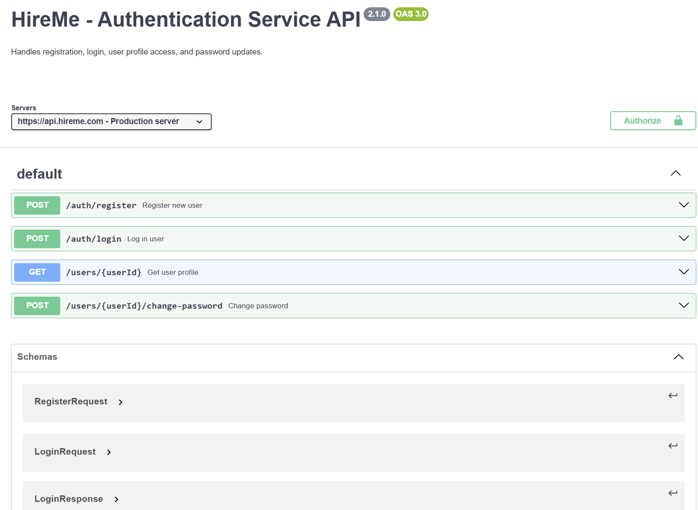
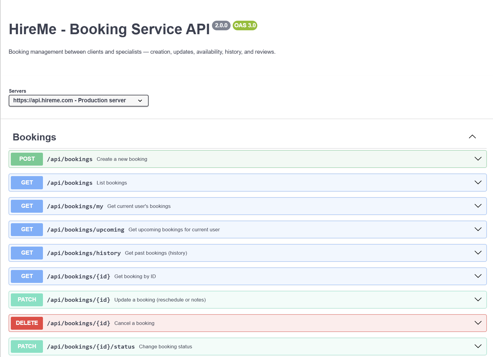
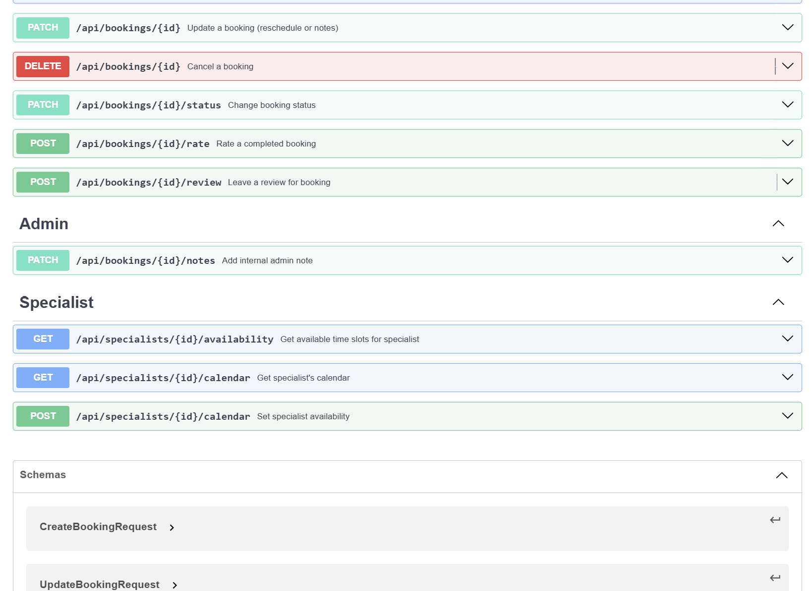
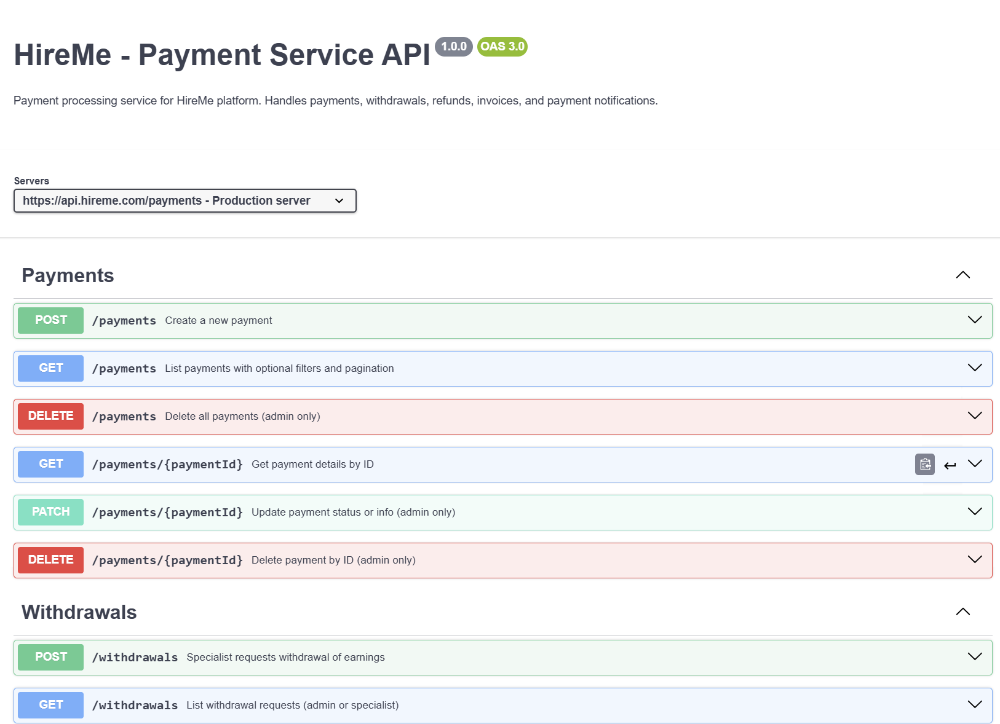
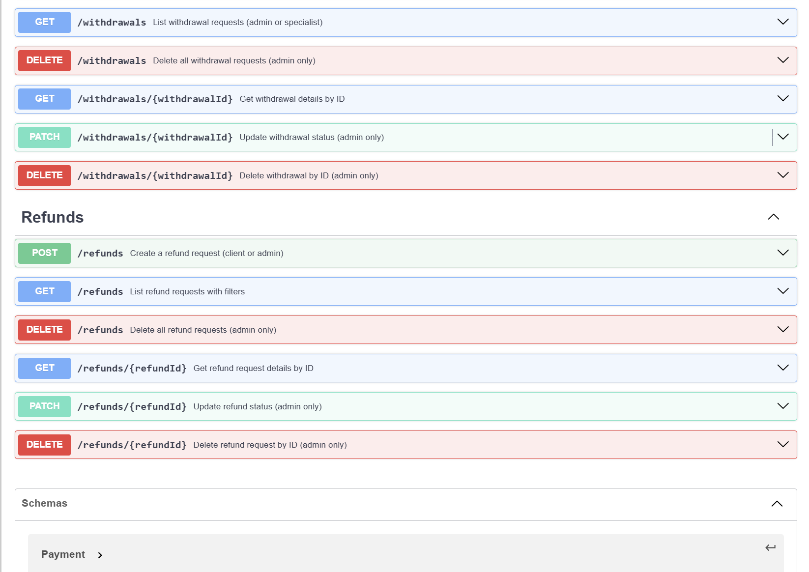
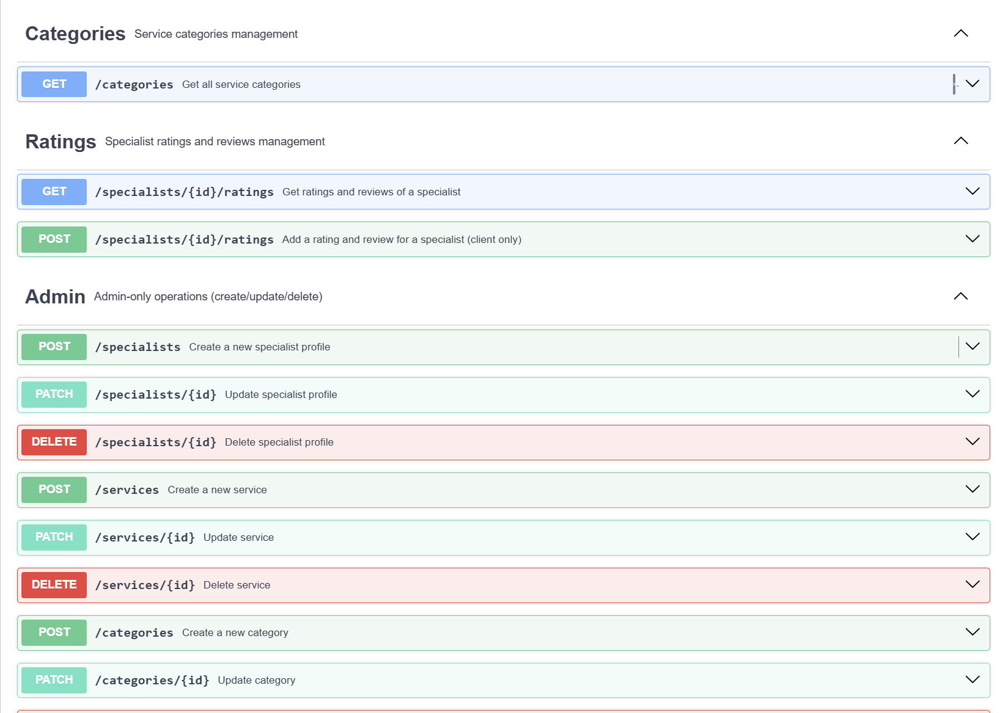
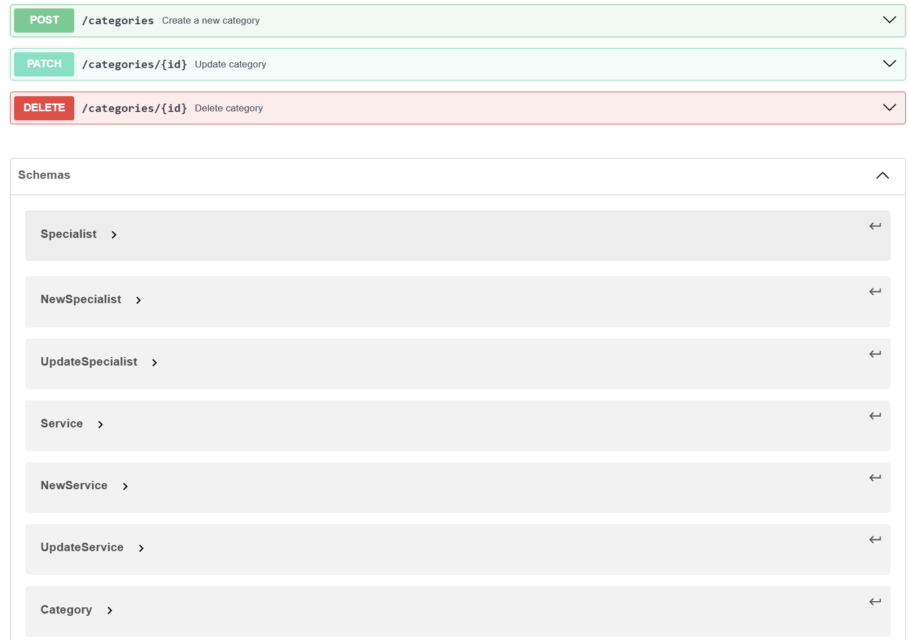

# HireMe
This application is designed to make booking services from various specialists, such as repairmen 🛠️, tutors 📚, and more, quick and easy! Users can effortlessly browse available specialists, check out their services, and schedule appointments in just a few clicks ⏰.
The platform offers secure authentication 🔒, a user-friendly booking system 📅, and smooth payment processing 💳. Notifications 🔔 are sent to keep users updated on their appointment status, so they never miss a thing! Built with scalability and modularity in mind, the system is divided into distinct services: authentication 🔑, booking management 📑, service catalog 🛍️, payments 💸, and notifications 📣—ensuring it grows with your needs!

## Main components
  - Authentication and Authorization Service: Manages user registration, login, session management, and access control based on user roles (e.g., clients, specialists).
  - Booking Service: Handles bookings, specialist availability, creating and canceling service appointments.
  - Catalog Service: Stores and provides information about available services, specialists, pricing, descriptions, and categories.
  - Payment Service: Processes financial transactions, billing, payment handling, possibly integrating with payment systems.
  - Notification Service: Sends notifications to users about booking statuses, reminders, and updates.
## Functional requirements
### 👤 Client:
  - As a client, I want to register using email and password so that I can access the platform.
  - As a client, I want to log in securely so that I can use my account.
  - As a client, I want to browse a list of specialists by category so that I can find someone I need.
  - As a client, I want to search for specialists by name, skill, or location so that I can quickly find the right person.
  - As a client, I want to view a specialist's profile so that I can learn more about their experience and services.
  - As a client, I want to view available time slots of a specialist so that I can book a convenient time.
  - As a client, I want to book a service from a specialist so that I can get help with my task.
  - As a client, I want to cancel a booking in case my plans change.
  - As a client, I want to receive email or in-app notifications when my booking is confirmed or changed.
  - As a client, I want to rate a specialist after the session so that others can see the quality of service.
  - As a client, I want to write a review about the specialist so that I can share my experience.
  - As a client, I want to see my upcoming and past bookings so that I can keep track of my service history.
  - As a client, I want to edit my personal profile (name, avatar, contact info) so that it's up-to-date.
  - As a client, I want to bookmark favorite specialists so that I can quickly find them again.
  - As a client, I want to pay for services online so that I don’t need to use cash.
  - As a client, I want to see recommended specialists based on my previous bookings so that I can save time.
  - As a client, I want to report inappropriate behavior or content so that it can be reviewed.

### 👨‍🔧 Specialist:
  - As a specialist, I want to register and mark myself as a service provider so that clients can find me.
  - As a specialist, I want to create and edit my public profile (description, category, experience) so that clients know what I do.
  - As a specialist, I want to upload a profile picture so that my profile looks trustworthy.
  - As a specialist, I want to define available time slots so that clients can book me when I’m free.
  - As a specialist, I want to receive notifications when someone books my services so that I can plan my day.
  - As a specialist, I want to confirm or reject bookings so that I can control my schedule.
  - As a specialist, I want to set or change the price for my services so that clients know what to expect.
  - As a specialist, I want to read reviews and ratings from clients so that I can improve my service.
  - As a specialist, I want to view upcoming and past bookings so that I can manage my workload.
  - As a specialist, I want to withdraw my earnings via bank so that I can get paid.

### 🛡️ Admin
  - As an admin, I want to view all users and specialists so that I can manage the platform.
  - As an admin, I want to deactivate or ban accounts that violate rules so that the platform stays safe.
  - As an admin, I want to moderate or remove inappropriate reviews so that the content is clean.
  - As an admin, I want to view system analytics (e.g., most active users, most booked categories) so that I can improve the platform.
  - As an admin, I want to manage reported users or content so that I can enforce community guidelines.

## Quality requirements
  ###Usability
    - The user interface must be intuitive and easy to use without requiring training.
    - The booking process should take no more than 3 steps.
    - The platform must be mobile-friendly and responsive across all devices.

### Performance
  - The system should respond to user actions in under 1 second in 95% of cases.
  - It must support at least 1000 concurrent users without significant performance degradation.
  
### Scalability
  - The architecture should support horizontal scaling of individual services.
  - Adding new service categories or specialists must not require changes to the core codebase.
  
### Security
  - User data must be securely stored (e.g., passwords encrypted using bcrypt).
  - All API requests must be secured using HTTPS.
  - A role-based access model must be implemented to ensure only authorized users can book or offer services.

### Availability
  - The system must maintain 99.9% uptime per month.
  - A failure in one service should not cause the entire system to crash (fault tolerance and resilience required).

### Maintainability
  - Each service should be independently deployable and modifiable without affecting others.
  - The codebase should follow standardized practices.
  - Unit and integration tests must cover at least 80% of the codebase.

### Interoperability
  - APIs must comply with the OpenAPI 3.0 specification.
  - The system should support easy integration with third-party services.

## 🧑‍💼 1. Auth Service

---

## 📅 2. Booking Service

---

## 💳 3. Payment Service

---

## 📢 4. Notification Service

---

## 🗂️ 5. Category Service

